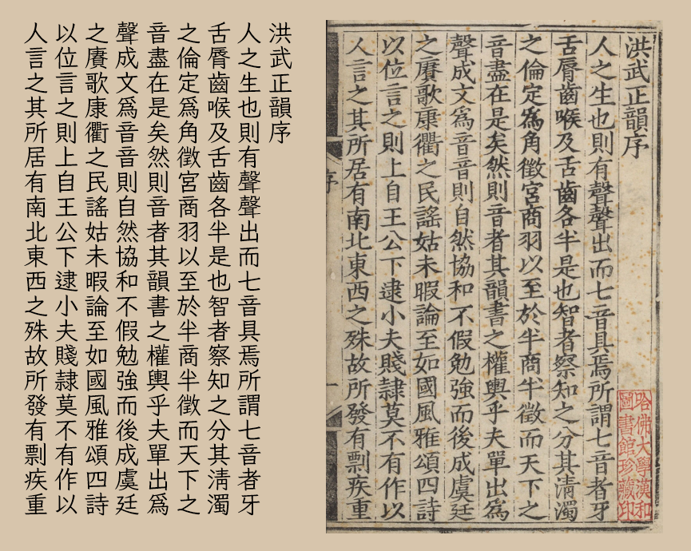

[繁體中文](../../) **简体中文**
# Bright Moon Kai 皓月楷 & Array Stars Kai 繁星楷
一套旧字形风格中文字体。

## Bright Moon Kai 皓月楷
基于[霞鹜文楷 TC](https://github.com/lxgw/LxgwWenkaiTC)、[霞鹜文楷](https://github.com/lxgw/LxgwWenKai)以及 [Klee](https://github.com/fontworks-fonts/Klee)，参照《洪武正韵》（明嘉靖四十年刘以节刊本）将点画拉直处理，使用[芫荽](https://github.com/ButTaiwan/iansui)的四笔「艹」部件, 并对一部分字形部件进行修改。  
  

## Array Stars Kai 繁星楷
由皓月楷修改，简入繁出的字体。此字体使用了 OpenType 功能，可根据文本内容动态匹配一简多繁的情况。

## 下载字体
可从本站 [Releases](../../releases) 页面下载字体。

## 授权
遵循 [SIL Open Font License 1.1](./LICENSE.txt)。

## 鸣谢
* [霞鹜文楷 TC](https://github.com/lxgw/LxgwWenkaiTC) [霞鹜文楷](https://github.com/lxgw/LxgwWenKai)
* [Klee](https://github.com/fontworks-fonts/Klee)
* [芫荽](https://github.com/ButTaiwan/iansui)
