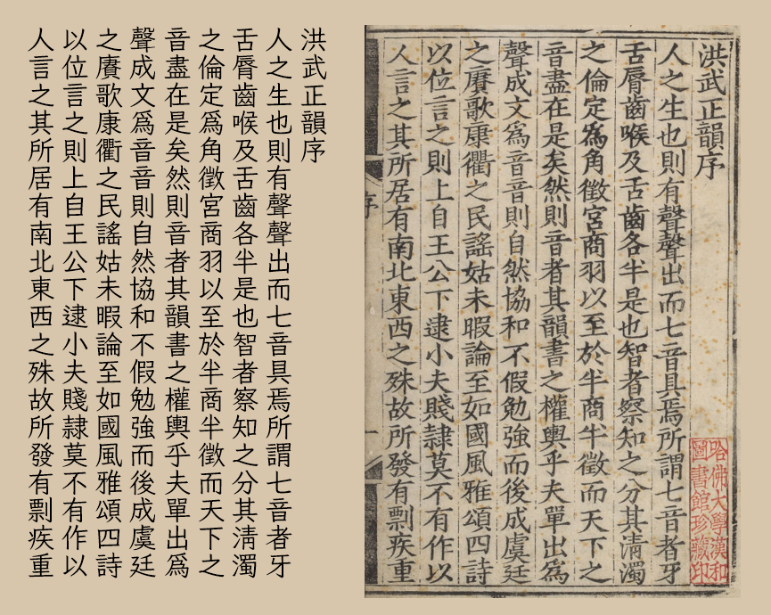

**繁體中文** [简体中文](README-SC.md)
# Moon Stars Kai 月星楷
一款由 [Klee](https://github.com/fontworks-fonts/Klee) 衍生舊字形或古體字形風格的中文字型。

## Moon Stars Kai 月星楷
在 [Klee](https://github.com/fontworks-fonts/Klee) 的基礎上，結合[霞鶩文楷 TC](https://github.com/lxgw/LxgwWenkaiTC)、[霞鶩文楷](https://github.com/lxgw/LxgwWenKai)以及[芫荽](https://github.com/ButTaiwan/iansui)字形，參照《洪武正韻》（明嘉靖四十年劉以節刊本）製作。部分字形在*現代書寫中已經很少見*，但可常見於書法字貼。  

  

## Moon Stars Kai T 月星楷 繁
由月星楷修改，簡入繁出的字型。此字型使用了 OpenType 功能，可根據文字内容動態匹配一簡多繁的情況。

## 下載字型
可從本站 [Releases](../../releases) 頁面下載字型。

## 授權
遵循 [SIL Open Font License 1.1](./LICENSE.txt)。

## 鳴謝
* [Klee](https://github.com/fontworks-fonts/Klee)
* [霞鶩文楷 TC](https://github.com/lxgw/LxgwWenkaiTC)、[霞鶩文楷](https://github.com/lxgw/LxgwWenKai)
* [芫荽](https://github.com/ButTaiwan/iansui)
* [FontForge](https://github.com/fontforge/fontforge)
* [otfcc](https://github.com/caryll/otfcc)
* [FontTools](https://github.com/fonttools/fonttools)
* [AFDKO](https://github.com/adobe-type-tools/afdko/)
* [OpenCC](https://github.com/BYVoid/OpenCC)
